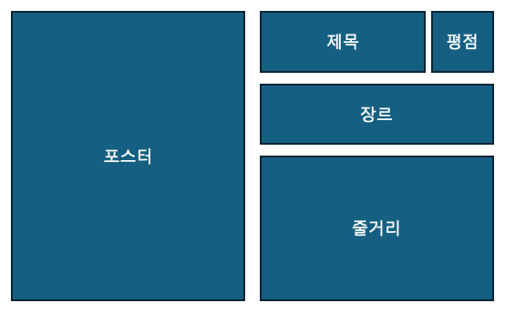
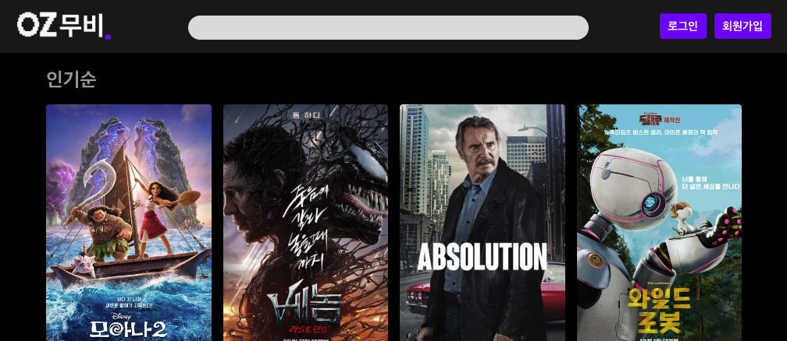

# 1단계

## 1단계 미션지 : 메인 페이지 및 영화 상세 페이지 레이아웃 구성

<aside>
📌 React와 CSS의 Flexbox 또는 Grid를 사용하여 영화 메인 페이지와 상세 페이지의 기본 레이아웃을 구성하고, React-Router-Dom을 사용하여 라우팅을 구현합니다. 또한, .gitignore를 사용하여 불필요한 파일이 Git에 업로드되지 않도록 합니다.

- VSCode에 React 앱 생성 (**Vite**)
</aside>

### **준비물**

- 새로운 레포지토리 생성 ( 배포 단계 오류 방지 )
- 더미데이터
    
    [mission1_data.zip](mission1_data.zip)
    

---

## **1. 더미데이터를 사용한 메인 페이지 (App.jsx) 레이아웃 구성**

### **요구 사항:**

<aside>
⭐ 이미지 baseUrl = "[https://image.tmdb.org/t/p/w500](https://image.tmdb.org/t/p/w500)"

</aside>

- 주어진 더미데이터의 압축을 풀고 **`movieListData.json`**을 이용하여 메인 페이지 레이아웃을 구성하세요.
- **`MovieCard`** 컴포넌트를 생성하고 영화를 렌더링합니다.
- **`MovieCard`** 컴포넌트에 포스터와 제목, 평점 정보를 전달해야 합니다.

### **레이아웃 예시:**

.png)

### **구현 단계:**

1. **`MovieCard`** 컴포넌트를 생성합니다.
2. **`App.jsx`** 파일에서 **`MovieCard`** 컴포넌트를 사용하여 영화 목록을 렌더링합니다.
    1. [map 메서드](https://developer.mozilla.org/ko/docs/Web/JavaScript/Reference/Global_Objects/Array/map)를 이용하여 영화 데이터를 **`MovieCard`**로  전달하세요.
3. **`App.jsx`** 파일에서 **`movieListData.json`** 데이터를 import하여 상태로 관리합니다.
4. **`MovieCard`** 컴포넌트는 필요한 데이터를 **`App.jsx`** 파일로 부터 전달받아 **포스터와 제목, 평점 정보**를 렌더링합니다.
5. **`movieListData.json`** 의 길이만큼 화면에 **`MovieCard`**를 렌더링합니다.

---

## **2. 더미데이터를 사용한 상세 페이지 (MovieDetail.jsx) 레이아웃 구성**

### **요구 사항:**

- 주어진 더미데이터의 압축을 풀고 **`movieDetailData.json`**을 이용하여 상세 페이지 레이아웃을 구성하세요.
- **`movieDetailData.json`**에는 아래와 같은 영화 정보가 들어 있습니다:
    - **backdrop_path**: 영화의 배경 이미지 경로
    - **belongs_to_collection**: 컬렉션에 속한 경우 컬렉션 정보 (여기서는 **`null`**로 설정)
    - **budget**: 영화의 제작 예산
    - **genres**: 영화의 장르 배열
    - **homepage**: 영화의 공식 홈페이지
    - **id**: 영화의 고유 ID
    - **imdb_id**: IMDb에서 영화의 고유 ID
    - **original_language**: 원어
    - **original_title**: 원제목
    - **overview**: 영화의 줄거리
    - **popularity**: 영화의 인기 지수
    - **poster_path**: 영화 포스터 이미지 경로
    - **production_companies**: 제작사 배열
    - **release_date**: 개봉일
    - **revenue**: 수익
    - **runtime**: 상영 시간 (분)
    - **spoken_languages**: 사용된 언어 배열
    - **status**: 개봉 상태
    - **tagline**: 태그라인
    - **title**: 제목
    - **video**: 비디오 여부
    - **vote_average**: 평균 평점
    - **vote_count**: 평점 수

### **상세 페이지에 포함될 요소**

- **backdrop_path**: 영화의 배경 이미지 경로 or **poster_path**: 영화 포스터 이미지 경로
- **title**: 제목
- **vote_average**: 평균 평점
- **genres**: 영화의 장르 배열
- **overview**: 영화의 줄거리

### **레이아웃 예시:**

### **구현 단계:**

1. **`MovieDetail`** 컴포넌트를 생성합니다.
2. **`movieDetailData.json`** 데이터를 import하여 **상태로 관리**합니다.
3. 상세 페이지 레이아웃에 필요한 요소를 JSX로 추가합니다.
4. Flexbox 또는 Grid를 사용하여 레이아웃을 구성합니다.

---

## **3. React-Router-Dom을 사용하여 라우팅 구성**

### **요구 사항:**

- **`react-router-dom`**을 설치하고 설정합니다.
- 라우팅을 구성하여 다음 경로를 설정합니다:
    - **`/`** 경로: 메인 페이지 ( **App.jsx** )
    - **`/details`** 경로: 상세 페이지 ( **MovieDetail.jsx** )

### **구현 단계:**

1. **`react-router-dom`**을 설치합니다:
2. **`main.jsx`** 또는 **`index.jsx`** 파일에서 **`BrowserRouter`**를 설정하고, 라우트를 정의합니다.
3. **`MovieCard`**를 클릭하면 **`/details`** 경로로 이동하도록 설정합니다.
    - **`/details`** 경로에는 더미데이터를 사용한 **MovieDetail** 페이지가 나와야 합니다.
    - 더미데이터를 사용했으므로, 어떤 **MovieCard**를 클릭해도 동일한 페이지로 이동합니다.

---

## **4. Layout Component를 사용하여 Nav바 상단에 표시**

### **요구 사항:**

- `Layout` 컴포넌트를 사용하여 앱의 모든 페이지 상단에 `NavBar`가 표시될 수 있도록 합니다.

### 레이아웃 예시:

### 구현 단계:

1. `NavBar` 컴포넌트를 생성합니다.
2. `Layout` 컴포넌트를 생성하여 `NavBar` 컴포넌트를 불러옵니다.
3. `Layout` 컴포넌트 내에서 `Outlet`을 사용하여 각 라우트에 연결된 페이지 콘텐츠가 표시될 수 있도록 설정합니다.

---

## **🔥 도전 미션(기본 미션을 다 수행한 후 진행하세요.)**

## **1. 슬라이드 구현하기 (Swiper 사용 또는 Swiper 없이 구현하기)**

### **요구 사항:**

- 영화 목록을 슬라이드 형식으로 보여주는 UI를 구현합니다.
- **`Swiper`** 라이브러리를 사용하거나, 직접 CSS와 JavaScript를 활용하여 슬라이드를 구현할 수 있습니다.

### **구현 단계:**

1. **`Swiper`** 라이브러리를 설치하고 설정하거나, CSS와 JavaScript를 사용하여 슬라이드 기능을 직접 구현합니다.
2. 슬라이드 형식으로 영화 목록을 렌더링합니다.

---

## **제출 및 검토**

<aside>
📌

**제출하기 전에**

1. 요구 사항 중에 놓친 부분이 없는지 다시 한 번 꼼꼼하게 살펴보세요.
2. 이번 미션을 수행하면서 알아야하는 주요 개념을 팀원 모두가 숙지했는지 점검하세요. 
(도전 미션은 제외입니다.)

**⚠️ 팀원이 조교의 질문에 제대로 답변을 하지 못하는 경우, 미션이 통과되지 않을 수 있습니다.**

</aside>

1. 본인 브랜치(이름)에 구현한 기능에 대한 PR을 올립니다.
    - 💌 **PR 제목은 `[mission1] 1단계 미션 구현 - 이름 / 팀명`**으로 해주세요.
2. 링크를 조교에게 DM으로 제출합니다.
3. 조교와 미팅으로 피드백을 받습니다.
    - 팀원 모두가 1단계를 수행하기 위한 기초 개념을 알고 있어야 합니다.
4. 평가 결과에 따라 **다음 단계로 진출** 또는 **보완 사항을 보완**합니다.
    - **`통과`**: 다음 단계 미션지를 받고 본인 브랜치에 코드를 병합합니다.
        - 코드 병합 후 기존 작업 브랜치를 삭제합니다. (`feature/mission-1`)
        - 다음 미션 구현을 위한 작업 브랜치를 생성하여 작업을 진행합니다. (`feature/mission-2`)
    - **`보완`**: 보완 사항을 보완하고 다시 PR을 제출합니다.

---

### **추가 참고 자료**

- [React 공식 문서](https://reactjs.org/docs/getting-started.html)
- [React Router 공식 문서](https://reactrouter.com/)
- [Flexbox 가이드](https://css-tricks.com/snippets/css/a-guide-to-flexbox/)
- [CSS Grid 가이드](https://css-tricks.com/snippets/css/complete-guide-grid/)
- [Swiper 공식 문서](https://swiperjs.com/)